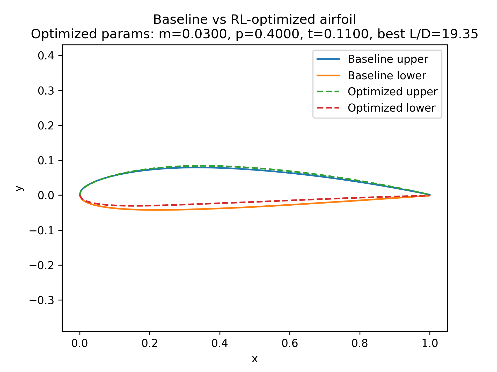

# ✈️ RL + XFOIL Airfoil Optimizer

Optimize NACA-like airfoils using **Reinforcement Learning + Aerodynamic Modeling**.  
A PPO agent learns to tune airfoil parameters \[m, p, t\] (max camber, camber position, thickness) to improve **lift-to-drag ratio (L/D)** across multiple angles of attack.

---

## 🌐 Live Demo

👉 **Streamlit App:** _add your deployed URL here, e.g._  
`https://airfoil-rl-optimizer.streamlit.app`

---

## 📸 Screenshots

> Replace the image paths with your actual files (for example, put PNGs in `assets/`).

### 1. Main UI – RL + XFOIL Airfoil Optimizer


### 2. Baseline vs RL-Optimized Airfoil



---

## 🚀 Key Features

- 🧠 **PPO Reinforcement Learning** using Stable-Baselines3.
- 🌀 **Custom Gymnasium Environment** for NACA-like airfoil optimization.
- 📐 **NACA 4-Digit Airfoil Generator** (`airfoil_gen.py`).
- 📊 **Multi-Angle Evaluation** at 0°, 4°, 8° using a smooth surrogate aero model.
- 🎯 **Reward = Mean L/D + Lift Bonus − Deviation Penalty** for realistic designs.
- 💻 **Streamlit Web App (`app.py`)** for interactive exploration and optimization.
- 📈 **Baseline vs RL-Optimized Comparison** with metrics and plots.

---

## 🧩 Airfoil Parameters

The airfoil is described by classic NACA-style parameters:

| Symbol | Description     | Typical Range |
| ------ | --------------- | ------------- |
| `m`    | Max camber      | 0.00 – 0.06   |
| `p`    | Camber position | 0.10 – 0.70   |
| `t`    | Thickness       | 0.11 – 0.18   |

The RL agent learns small updates Δ\[m, p, t\] within these bounds.

---

## 📂 Project Structure

````text
airfoil-rl-optimizer/
│
├── models/                     # Trained PPO agent(s)
│   └── ppo_airfoil_fake.zip
│
├── assets/                     # Screenshots / images for README & app
│   ├── app_main.png
│   └── optimized_airfoil.png
│
├── aero_eval.py                # Surrogate aerodynamic model (Cl, Cd, L/D)
├── airfoil_env.py              # Custom Gymnasium environment
├── airfoil_gen.py              # NACA 4-digit airfoil geometry generator
├── analyze_policy.py           # Evaluate and plot best RL airfoil
├── compare_multi.py            # Baseline vs optimized L/D across AoA
├── test_env.py                 # Simple environment sanity checks
├── train_rl.py                 # PPO training script
│
├── app.py                      # Streamlit web app entry point
│
├── requirements.txt            # Python dependencies
├── .gitignore
├── LICENSE                     # MIT License
└── README.md

---

## ⚙️ Installation & Setup

### 1️⃣ Clone the Repository

```bash
git clone https://github.com/mohamednoorulnaseem/airfoil-rl-optimizer.git
cd airfoil-rl-optimizer
````

### 2️⃣ Create and Activate Environment (Conda Recommended)

```bash
conda create -n airfoil_rl python=3.10 -y
conda activate airfoil_rl
```

### 3️⃣ Install Required Packages

```bash
pip install -r requirements.txt
```

---

## 🧠 Train the PPO Agent (Optional)

A pretrained model is included, but you can train again:

```bash
python train_rl.py
```

This will:

- Train a PPO policy on the custom Airfoil environment
- Save the model in the `models/` directory

---

## 📊 Compare Multi-Angle Performance (0°, 4°, 8°)

```bash
python compare_multi.py
```

Example Output (will vary):

```
AoA |  L/D baseline  |  L/D optimized
----------------------------------------
 0.0 |         8.18 |         10.00
 4.0 |        30.00 |         20.91
 8.0 |        19.09 |         17.06
```

---

## 🌐 Run the Streamlit App Locally

```bash
streamlit run app.py
```

Features include:

- Manual slider for airfoil parameters
- RL-Optimized parameters using PPO agent
- Airfoil geometry plots
- L/D metrics table
- Multi-AoA comparison

---

## ☁️ Deploying to Streamlit Cloud

1. Push this repository to GitHub
2. Go to: https://share.streamlit.io/
3. Provide:
   - **Repo:** `mohamednoorulnaseem/airfoil-rl-optimizer`
   - **Main file:** `app.py`
   - **Python version:** `3.10`

> No secret keys are required for this project.

---

## 🧮 Reward & RL Design Overview

The RL agent receives the state:

```
[m, p, t, Cl_mid, Cd_mid]
```

Actions are small continuous changes to parameters:

```
Δ[m, p, t] ∈ [-0.005, 0.005] × [-0.05, 0.05] × [-0.01, 0.01]
```

The reward encourages realistic and efficient airfoils:

```
reward = mean(L/D at 0°,4°,8°)
         + 0.5 * Cl_mid
         - 0.05 * distance_from_baseline²
```

---

## 🧾 License

This project is licensed under the **MIT License**.  
You may modify, distribute, and use it with attribution.

---

## 👨‍💻 Author

**Mohamed Noorul Naseem**  
GitHub: https://github.com/mohamednoorulnaseem  
If you like this project, don’t forget to ⭐ the repo!

---

✈️ _Happy Airfoil Optimization!_ 🧠
